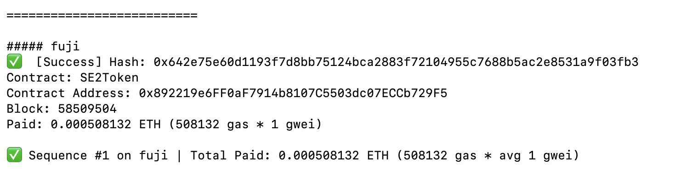

# Task 2：<第二章 Vibe Coding开发你的第一个DApp>

> 对应课程：第二章 
> 截止提交：<9月6日> 24:00:00 (UTC+8)

## 任务目标

掌握 Vibe Coding 技巧，用 Scaffold-ETH 自己部署 ERC20 合约的应用

## 参考资料
Scaffold-ETH 项目开发模板
https://scaffoldeth.io/
https://github.com/scaffold-eth/scaffold-eth-2

领取 Avalanche Fuji 测试网 token
https://build.avax.network/console/primary-network/faucet

## 任务要求
把合约成功部署至Avalanche 测试网

## 提交方式
提供部署成功后截图，以及链上合约的地址

✅  Contract: SE2Token

Contract Address: 0x892219e6FF0aF7914b8107C5503dc07ECCb729F5

在部署第一个ERC20合约的过程中，最耗时间的反而是Github下载数据，不断失败重试，利用Codex拆解遇到的问题，更换从Github下载数据的方式，最终完成在安装过程中所需要的数据下载。

## 截止时间

<9月6日> 24:00:00 (UTC+8)
